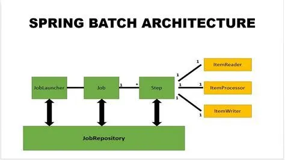

# Spring Batch Example

A small Spring Boot + Spring Batch example that reads products from a CSV file,
calculates a discounted price for each product, and writes the results into a
relational database using JDBC batch inserts.

This repository is intended as a minimal reference for how to configure and
run a simple Spring Batch job with reader -> processor -> writer steps.

# Spring Batch Architecture



## Features / Summary

- Reads `data.csv` (classpath) using a `FlatFileItemReader`.
- Transforms each record with `CustomItemProcessor` (computes discounted price).
- Persists results into the `products` table using a JDBC batch `ItemWriter`.
- Uses Spring Batch metadata tables (created automatically) to track job/step
	execution state.

## How it works (brief)

1. The `Job` (defined in `BatchConfig`) contains a single `Step` named
	 `jobStep`.
2. The Step is configured with chunking (chunk size = 10). For each chunk the
	 framework reads rows from the CSV, passes each `Product` to the processor,
	 and writes the processed items to the database in a batch.
3. `CustomItemProcessor` parses price and discount percent to compute
	 `discountedPrice` and sets it on the `Product` bean.
4. `JdbcBatchItemWriter` performs the insert into the `products` table.

## Configuration

Edit `src/main/resources/application.properties` to point to your database. By
default the project is configured for MySQL:

```
spring.datasource.url= jdbc:mysql://localhost:3306/spring_batch
spring.datasource.username= root
spring.datasource.password= root
spring.datasource.driver-class-name= com.mysql.cj.jdbc.Driver
```

The file `src/main/resources/schema.sql` creates the `products` table used by
the writer. Spring will execute this on startup (see `spring.sql.init.mode`).

## CSV input format

The reader expects a CSV with a header row. Column order / names used by the
reader are:

`productId,title,description,price,discount`

Example (first line in `src/main/resources/data.csv`):

`productId,title,description,price,discount`

## Database schema (products table)

`src/main/resources/schema.sql` contains:

```sql
CREATE TABLE IF NOT EXISTS products (
	product_id varchar(100) primary key,
	title varchar(200),
	description varchar(200),
	price varchar(10),
	discount varchar(10),
	discounted_price varchar(10)
);
```

Note: fields are stored as strings in this example for simplicity. For a
production system prefer numeric types for `price` and `discounted_price`.

## Verify results

After the job finishes, query the `products` table to verify the inserted rows
and the calculated `discounted_price`.

Example SQL:

```sql
SELECT product_id, price, discount, discounted_price FROM products LIMIT 10;
```
This should return the first 10 products with their prices and calculated
discounted prices.

